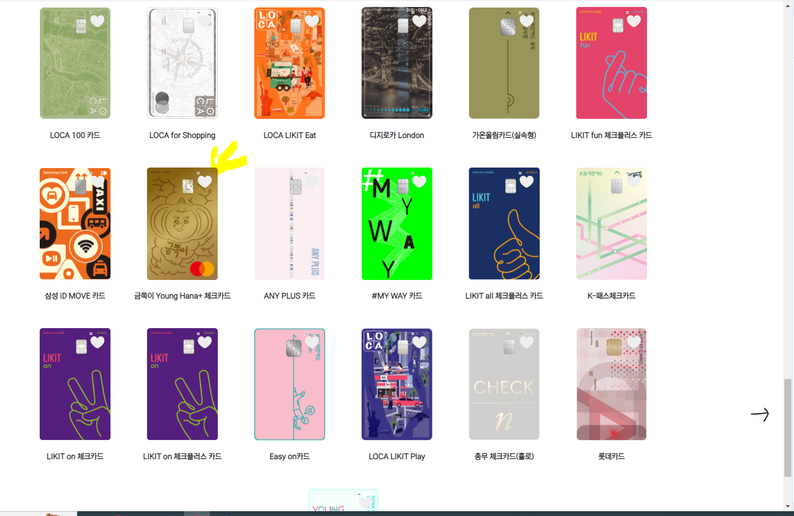
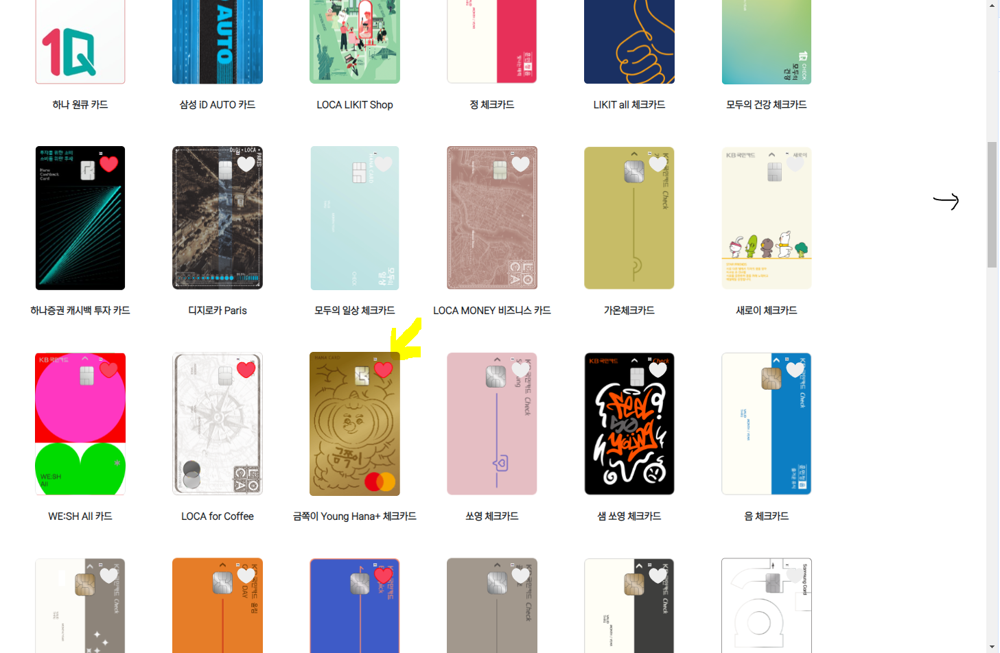
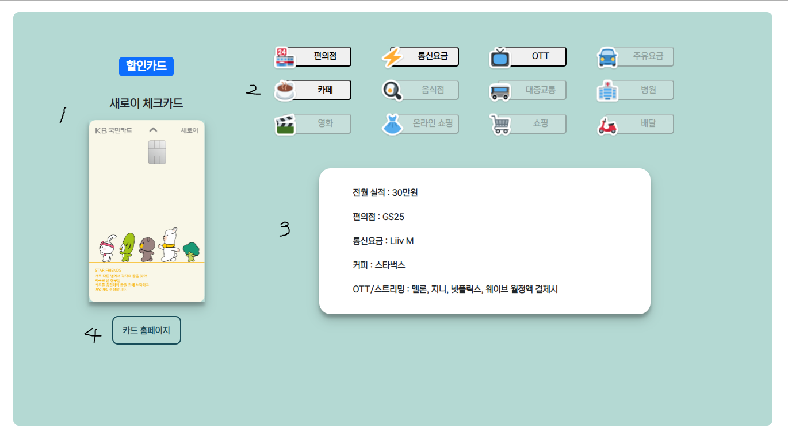
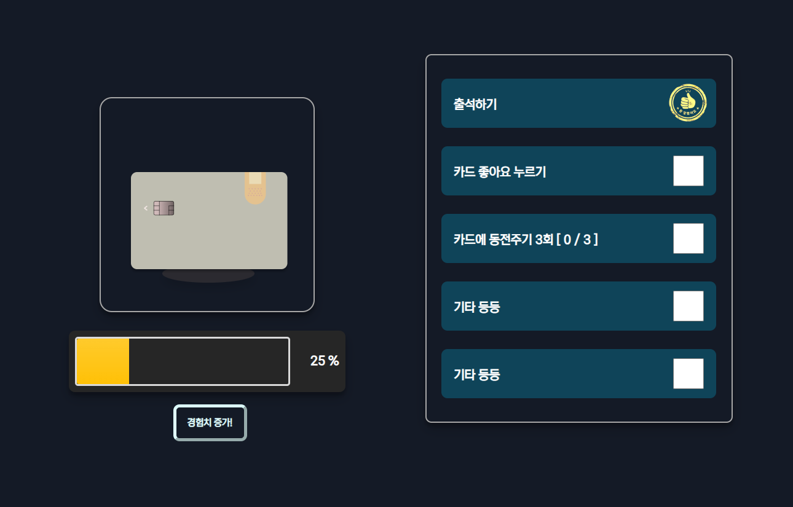
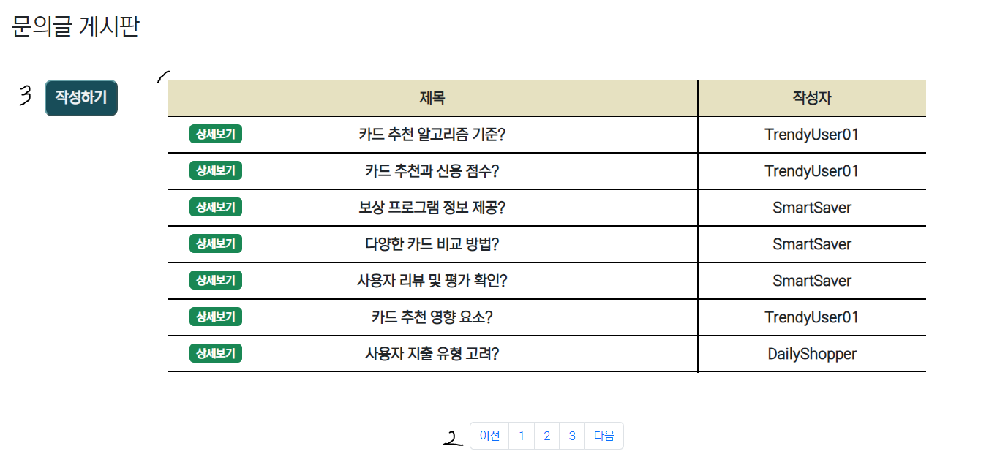
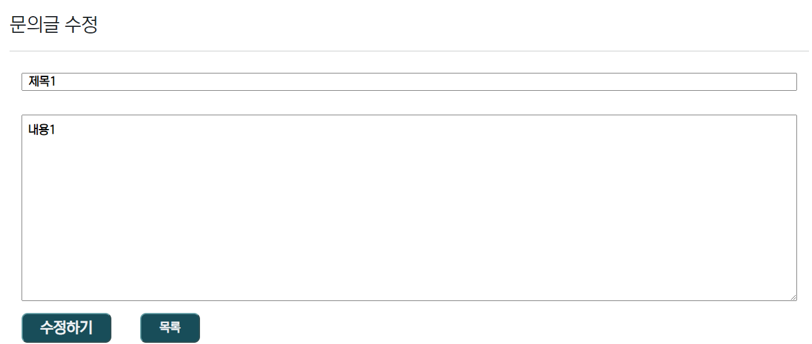
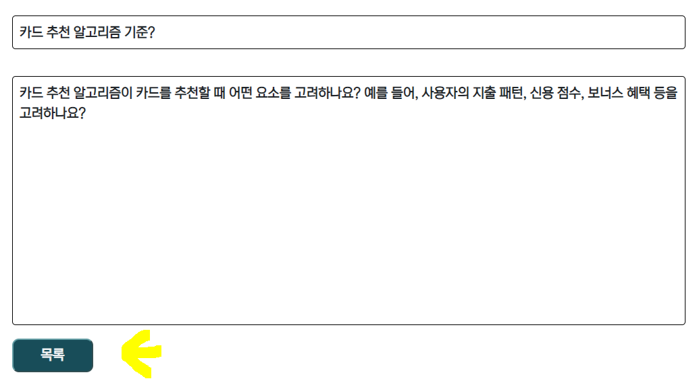
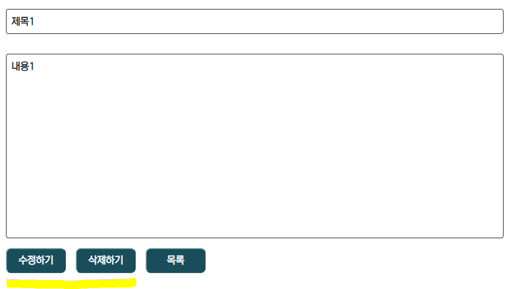
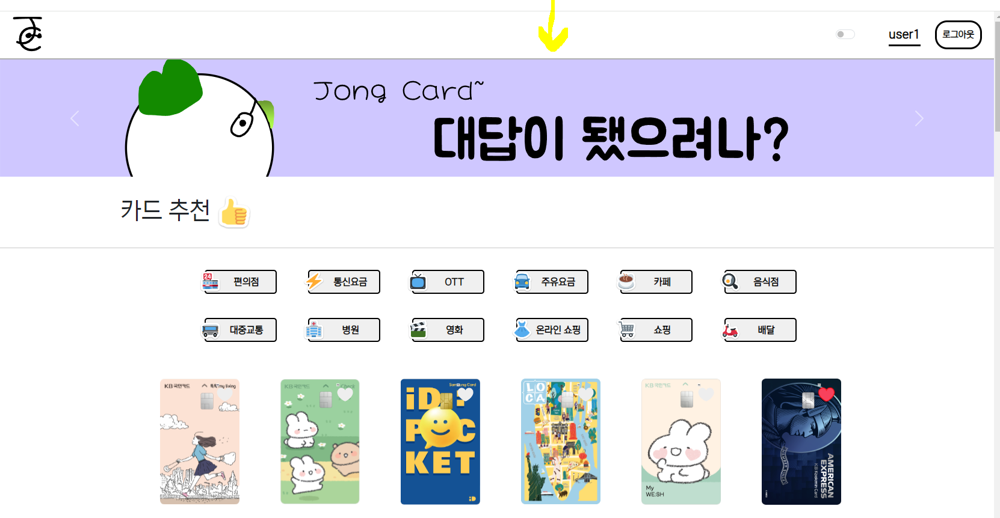
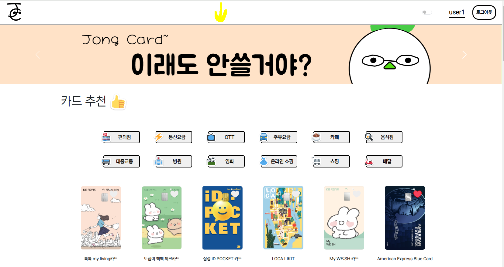

## 목차

## | [기획](#1-기획) | [목업](#2-목업디자인) | [ERD](#3-erd) | [기능](#4-웹사이트-기능들-사용방법) | [느낀점](#5-느낀점) |

## 팀 정보

### ㅇㅇㅇ `팀장 Backend` : 데이터 전처리, 알고리즘 구현, 아이디어 구상, 발표

### ㅁㅁㅁ `팀원 Frontend` : UI 구현, 디자인 구상, 아이디어 구상

## Skills

### Back

### Front

## 1. 기획

> 카드 혜택 별 추천 웹 사이트

### 주요 기능

#### `1. 할인율 시각적으로 보여주기`

- 각 혜택별로 얼마나 할인이 되는지를 대표 제품의 가격으로 확인할 수 있게 만들자!
  > ex ) 커피: ~~5000원~~ = 4500원

#### `2. 정렬 기능`

- 카드사
- 카드 혜택 유/무
- 좋아요순

#### `3. 로그인 / 회원가입 기능`

- 로그인/회원가입 기능은 필수!

#### `4. 문의글 작성하기 - (로그인 필요)`

- 로그인한 사용자가 궁금한 점을 문의할 수 있는 문의글 게시판을 만들자!
- 정렬 기능 추가 `(고려)`

#### `5. 카드 키우기 -(로그인 필요)`

- 사이트에 사용 시간을 늘리기 위해서 고안한 기능
- 미션을 수행하면 카드에 경험치를 획득할 수 있음
- 레벨업 할때마다 이미지를 변경시켜 새로움을 느끼게 할 예정

## 2. 목업(디자인)

### `메인 페이지`

- 네비게이션바는 최대한 심플하게 갈 예정
- 헤더부분은 `캐러셀`을 구현하여 추천 카드를 보여줄 예정
- 주요 기능들에 들어갈 수 있는 아이콘을 만든다
- 공지사항과 문의글을 볼 수 있는 영역을 밑에 둔다 `(변경 가능)`

### `광고 헤더`

- `JongCard`의 시그니처 캐릭터를 활용하여 광고성 헤더`(슬라이드 이미지 활용)`를 만들 예정

### `카드 추천 및 혜택 정렬 페이지`

- 상단에 각 혜택별로 선택할 수 있는 버튼을 만든다
- 버튼을 누르면 해당 혜택이 있는 카드를 정렬해서 다시 나타낸다
- 각 카드별 좋아요 버튼도 넣을 예정!

### `카드 혜택 상세페이지`

- 혜택별 대표 상품을 할인율에 따라 가격차이를 시각적으로 보여준다
- 혜택이 없는 메뉴는 비활성화

### `로그인/회원가입`

> 회원가입: 닉네임, 비밀번호, 비밀번호확인
>
> 로그인: 닉네임, 비밀번호

- 회원가입과 로그인 버튼을 누르면 각각에 입력해야할 창이 바뀌게 할 예정

### `카드 키우기`

- 카드를 누르면 동전이 떨어지는 효과
- 미션을 수행하면 경험치 증가
- 레벨업을 하면 카드가 바뀜

### `문의글 게시판`

- 심플하게 만들 예정!
- 더미 데이터를 추가하여 여러 페이지를 만들어서 넘어가게 만들 `예정`git

## 3. ERD

1. `user`가 생성할 수 있는 `article(문의글)`은 `1:N`의 관계를 가짐
2. `user`가 생성할 수 있는 `grow_card(카드 키우기)`는 유저당 1개를 생성할 수 있기 때문에 `1:1`의 관계를 가짐
3. `user`가 'card'의 좋아요를 N개만큼 할 수 있고, 'card'에 좋아요를 누른 사람이 N명이 있을 수 있기 때문에 `N:M`관계를 가짐
4. `card`의 정보와 `card`가 가지는 `benefit(혜택)`을 따로 두었다.(정보 처리를 위해) `card`에 해당하는 `benefit(혜택)`은 하나이기 때문에 `1:1`관계를 가짐

## 4. 웹사이트 기능들 (사용방법)

#### [1. 메인페이지](#메인페이지---기능)

#### [2. 로그인/회원가입페이지](#회원가입로그인-페이지---기능)

#### [3. 카드 추천페이지](#카드-추천페이지---기능)

#### [4. 카드 상세페이지](#카드-상세페이지---기능)

#### [5. 카드 키우기](#카드-키우기---기능)

#### [6. 마이페이지](#마이페이지---기능)

#### [7. 문의글 게시판페이지](#문의글---기능)

#### [+ 광고 헤더](#광고-헤더---기능)

## 메인페이지 - 기능

#### 1. 네비게이션 바

1. `로고` : `JongCard`의 `J`와 `C`를 활용하여 로고를 제작
2. `유저 닉네임(마이페이지)` : 로그인시 유저 닉네임이 활성화 됨, 클릭시 마이페이지로 이동
3. `로그인/로그아웃`: 로그인시 로그아웃 버튼을, 로그인이 되어있지 않으면 로그인 버튼 활성화

#### 2. 헤더

- 카드 리스트 중 제일 추천하는 카드를 슬라이드 이미지로 넣어둠
- 메인으로 나타내는 카드는 상세정보와 추천 메세지를 보여주도록 함

#### 3. 메인

1. 웹 사이트의 메인 기능들을 모아둠
2. 공지사항 게시판
3. 문의글 게시판을 축약해서 넣어둠

## 회원가입/로그인 페이지 - 기능

- 위의 버튼을 통해 회원가입과 로그인을 한 페이지에서 가능하도록 구현함
- 닉네임에 특수문자 금지, 빈값 금지, 비밀번호 빈값 금지 등 간단한 유효성 검사를 넣어둠

## 카드 추천페이지 - 기능

1. 카드가 가지고 있는 혜택들을 필터로 만듬
2. 혜택을 가지고 있는 카드들이 정렬되어 나타남
3. 카드에 좋아요를 만들 수 있는 기능이 있음

- 카드를 누르면 해당 카드의 상세 페이지로 이동함
  > 좋아요 알고리즘 적용
  >
  > 카드를 좋아요 누르면 해당 카드를 좋아요한 유저의 좋아요 카드리스트의 정보를 가져와 알고리즘을 적용시켜 재정렬함

- 맨 아래쪽에 있던 '금쪽이 카드'가 좋아요를 눌렀을 때 상단까지 올라온 것을 볼 수 있다.

## 카드 상세페이지 - 기능

1. 상세보기한 카드의 정보가 나타남 (`할인/적립` 정보도 상단에 배치함)
2. 혜택 버튼을 누르면 해당 혜택의 할인 정보를 볼 수 있음
3. 할인 정보를 대표 가격과 비교해서 나타내줌
4. 해당 카드의 실제 홈페이지에 갈 수 있도록 만든 버튼

## 카드 키우기 - 기능

> 카드 키우기페이지에만 `다크모드`를 적용시킴

1. 자신이 키우는 카드 캐릭터

- 클릭시 자신의 카드에 돈을 먹일 수 있음
- 레벨에 따라 카드의 이미지가 달라짐 ( 5 레벨까지 있음 )

2. 카드의 경험치를 나타냄

- 미션을 클리어하면 경험치가 증가함

3. 미션들을 나타냄

- 해당 미션을 성공하면 참 잘했어요 도장이 찍힘
- 현재는 미션이 정해져 있지만 나중에는 여러개를 만들어 랜덤으로 정해주면 더 좋을 듯

4. 경험치 증가 버튼

- 현재는 정해진 미션이 3개라 경험치의 변화를 느끼기 어려워 자체적으로 경험치를 증가 시킬 수 있는 버튼을 만듬

## 마이페이지 - 기능

1. 카드 키우기에서 키우는 카드를 보여주도록 함 (없을 시 캐릭터를 넣음)
2. 유저의 정보와 카드 추천페이지에서 좋아요를 누를 카드의 목록이 나옴 (많을 시 스크롤)

## 문의글 - 기능

### 1. 문의글 목록

1. 각 유저들이 쓴 문의글 목록들이 나온다.

- 상세보기를 통해 해당 문의글의 상세 페이지에 들어갈 수 있다.

2. 문의글 게시판의 페이지가 나온다.

- 페이지당 7개의 문의글이 나오도록 만들었다.

3. 로그인한 사용자라면 문의글을 작성할 수 있다.

### 2. 문의글 작성 / 수정

- 문의글을 작성할 수 있다 (로그인 시)
- 자신의 문의글이라면 수정 가능

### 3. 문의글 상세

- 해당 페이지의 상세 내용을 볼 수 있다.
- 자신이 쓴 글이라면 수정과 삭제를 할 수 있도록 만들었다.

## 광고 헤더 - 기능

- 카드 추천, 문의글페이지에 웹 페이지를 홍보하는 광고 배너를 만들어서 추가했다.
- 3개의 광고 배너가 자동으로 슬라이드 된다. (현재는 광고를 모두 보여주기 위해 넘어가는 속도를 빠르게 해둠)

## 5. 느낀점

- 데이터 크롤링을 통해 데이터를 받아오려고 했으나 카드마다 할인 및 적립 기준이 너무 다양했기 때문에 원하는 방식으로 데이터를 받아오는 것이 힘들었다. 다음부터는 기획에서부터 더 시간 효율적으로 만들 수 있는 아이디어를 구상해봐야겠다.
- 카드사 홈페이지 안을 찾으면서 내가 원하는 정보를 찾기 힘든 경우도 꽤 있었다. 사용자 편의성을 우선적으로 사이트를 만들어야 함을 느꼈다.
- 알고 있다고 생각했으나 만들면서 생각대로 되지 않는 것이 많아서 힘들었다. 앞으로 많은 경험과 프로젝트를 통해서 노하우를 가져가야겠다.
